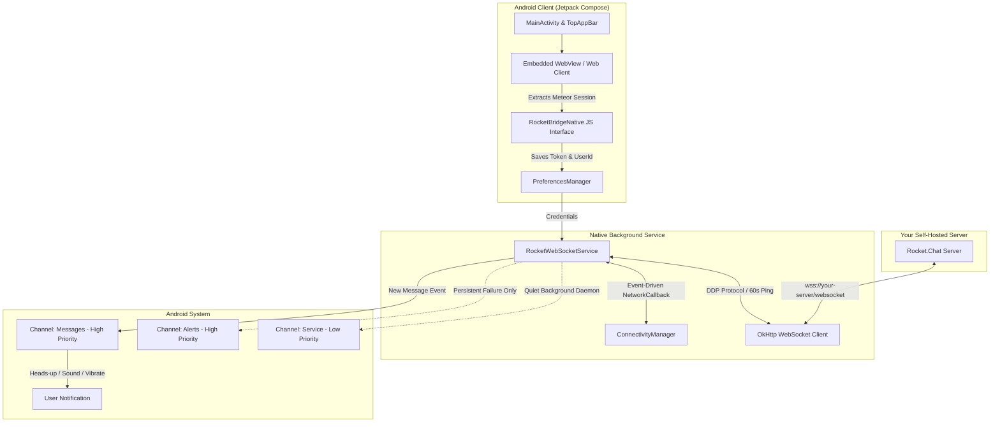

<div align="center">

# RocketBridge 🚀

**Lightweight, de-Googled Android client for Rocket.Chat with guaranteed real-time push notifications — zero Firebase (FCM), zero cloud limits.**

[-3DDC84?logo=android&logoColor=white)](https://android.com)
[](https://kotlinlang.org)
[](https://developer.android.com/jetpack/compose)
[](LICENSE)
[](https://github.com/petersonbasso/rocketbridge)
[](https://github.com/petersonbasso/rocketbridge/pulls)

[Download APK](https://github.com/petersonbasso/rocketbridge/releases) • [Features](#-features) • [Architecture](#-architecture) • [Building](#-building-from-source) • [FAQ](#-faq--troubleshooting)

</div>

---

## 📖 Overview

**RocketBridge** is an independent, lightweight, open-source Android client specifically engineered for self-hosted, enterprise, and community [Rocket.Chat](https://rocket.chat) servers. 

It solves the push notification dilemma for self-hosted instances by eliminating the need for Google Firebase Cloud Messaging (FCM) or paid Rocket.Chat Cloud push gateway quotas. Using a battery-optimized native Android Foreground Service, RocketBridge connects directly to your server's WebSocket and delivers instant, reliable local push notifications.

---

## 🎯 The Problem RocketBridge Solves

For organizations and users hosting Rocket.Chat Community (public sector, educational institutions, private enterprises, home lab enthusiasts):

| Official App & Approaches | The Limitation | The RocketBridge Solution |
| :--- | :--- | :--- |
| **Official Play Store App** | Requires Rocket.Chat Cloud Push Gateway. Community servers face monthly push notification quotas; once reached, notifications are dropped. | **Zero Cloud Gateway:** Connects directly to your own server (`/websocket`). No monthly quotas, no subscription costs. |
| **PWAs / WebAPKs** | Modern mobile OSes aggressively freeze browsers and drop background WebSockets when the screen turns off or Doze mode activates. | **Persistent Native Service:** A dedicated Android Foreground Service keeps the connection alive reliably across Doze mode. |
| **Custom FCM Build** | Requires maintaining a custom fork of Rocket.Chat's React Native codebase, generating Google Firebase keys, and rebuilding apps. | **Plug & Play:** Just enter your server URL and log in. No source compilation or Google Cloud console setup needed. |
| **Privacy & De-Googling** | Official push notifications route message metadata through third-party cloud infrastructure (Google FCM, Rocket.Chat Cloud). | **100% Direct & Private:** Communication is strictly between your phone and your private server. No analytics, tracking, or telemetry. |

---

## ✨ Features

- ⚡ **Direct WebSocket Push Notifications**  
  Uses Meteor's DDP protocol with strict subscription to `stream-notify-user: <userId>/notification` for instant delivery with near-zero server overhead.
- 🔋 **Battery-First Engineering**  
  - **Passive Heartbeat:** Reactively responds to server-initiated DDP pings without generating unnecessary wakeups.
  - **60s Keep-Alive:** Balances NAT firewall persistence with maximum radio modem sleep time.
  - **Deep Sleep Friendly:** CPU enters low-power Doze mode freely when no messages are incoming.
  - **Event-Driven Network Switch:** Instantly reconnects when switching between Wi-Fi and Cellular (4G/5G) using native OS network callbacks (zero polling).
- 🤫 **Silent Background Persistence & Intelligent Alerting**  
  - Background service notification is completely quiet and unobtrusive (`onlyAlertOnce`, silent, deferred). Opening the app does not trigger annoying pop-ups.
  - **Dedicated Failure Alerts:** If connection to your server is lost for extended periods (after 3 consecutive failed retries), an actionable alert notifies you to check your network. As soon as connectivity returns, the alert automatically dismisses.
- 🎨 **Modern Jetpack Compose & Material 3 UI**  
  - Native Compose layout with Material You dynamic styling.
  - Real-time connection health badge (🟢 Connected, 🟡 Connecting, 🔴 Offline) visible directly on the top bar.
- 🔑 **Automated Session Bridge**  
  - Log in through your standard web login screen (including SSO/LDAP/2FA).
  - The native bridge automatically detects `Meteor.loginToken` and `Meteor.userId` from local storage and activates native notifications instantly.
- 🌐 **Full Multimedia Support**  
  - Hardware-accelerated WebView supporting file uploads, camera capture, voice notes, audio playback, and custom emojis.

---

## 🏗️ Architecture

RocketBridge combines a modern native Android UI with an efficient background daemon and an embedded web client.

### Data Flow Diagram



### Key Modules

- **[`RocketWebSocketService`](app/src/main/java/io/rocketbridge/service/RocketWebSocketService.kt):** Core background daemon handling WebSocket lifecycle, backoff reconnection, DDP handshake, authentication, and incoming push payloads.
- **[`MainActivity`](app/src/main/java/io/rocketbridge/MainActivity.kt):** Main activity featuring Compose TopAppBar with real-time status flow, server configuration menu, and reconnection controls.
- **[`RocketBridgeWebView`](app/src/main/java/io/rocketbridge/ui/webview/RocketBridgeWebView.kt):** Web container with custom JavascriptInterface that extracts the Meteor authentication token on login.
- **[`PreferencesManager`](app/src/main/java/io/rocketbridge/data/PreferencesManager.kt):** Encapsulates local persistence for server endpoint and session credentials.
- **[`BootReceiver`](app/src/main/java/io/rocketbridge/service/BootReceiver.kt):** Listens for `BOOT_COMPLETED` to resume background notification delivery immediately when your phone restarts.

---

## 📲 Getting Started

### Installation

1. **Download the APK** from the [GitHub Releases](https://github.com/petersonbasso/rocketbridge/releases) page or via F-Droid / IzzyOnDroid.
2. Open the downloaded `.apk` file and tap **Install** (allow unknown sources if prompted).
3. **Grant Permissions:**
   - **Notifications (`POST_NOTIFICATIONS`):** Required to display chat alerts on Android 13+.
   - **Battery Optimization Exemption:** Prompts to disable battery optimization so Android OEM task-killers (e.g., Samsung, Xiaomi, Motorola) do not kill the background WebSocket.
4. **Connect to Your Server:**
   - Enter your server URL (e.g., `https://chat.yourcompany.com`).
   - Sign in with your regular username and password, LDAP, or SSO.
   - You're all set! Notifications will now be delivered reliably in real-time.

---

## 🛠️ Building from Source

### Prerequisites

- **Java Development Kit (JDK):** OpenJDK 17 or higher
- **Android SDK:** Platform API 36, Build-Tools 36.0.0
- **Android NDK:** Optional (pure Kotlin/Java project)

### Build Commands

```bash
# 1. Clone the repository
git clone https://github.com/petersonbasso/rocketbridge.git
cd rocketbridge

# 2. Build Signed Release APK
./gradlew assembleRelease

# Output APK location:
# app/build/outputs/apk/release/RocketBridge-v1.0.1-release.apk
```

### Installing onto a Connected Device via ADB

```bash
# Enable USB Debugging on your phone, connect the cable, then run:
adb install -r app/build/outputs/apk/release/RocketBridge-v1.0.1-release.apk

# Launch the app:
adb shell am start -n io.rocketbridge/.MainActivity
```

---

## 🔒 Permissions & Privacy

RocketBridge is built with a **privacy-first and zero-telemetry** philosophy:

| Permission | Purpose |
| :--- | :--- |
| `android.permission.INTERNET` | Connect to your Rocket.Chat server via HTTPS and WSS (WebSocket). |
| `android.permission.ACCESS_NETWORK_STATE` | Detect network changes (Wi-Fi ↔ Mobile Data) to trigger smart reconnections. |
| `android.permission.POST_NOTIFICATIONS` | Post local message notifications (Android 13+). |
| `android.permission.FOREGROUND_SERVICE` | Maintain the background listener active when the app is closed. |
| `android.permission.FOREGROUND_SERVICE_REMOTE_MESSAGING` | Android 14+ specific foreground service type for chat messaging. |
| `android.permission.WAKE_LOCK` | Acquire a brief 2-second wake lock to display the notification with sound/vibrate when screen is locked. |
| `android.permission.RECEIVE_BOOT_COMPLETED` | Restore background push monitoring automatically after phone restarts. |
| `android.permission.REQUEST_IGNORE_BATTERY_OPTIMIZATIONS` | Request exemption from aggressive OEM task-killers to ensure unbroken sync. |

> [!NOTE]
> RocketBridge does **not** contain any third-party advertising SDKs, tracking libraries, crash reporters, or analytics frameworks. All network communication is strictly end-to-end between your device and the Rocket.Chat server URL you provide.

---

## ❓ FAQ & Troubleshooting

<details>
<summary><b>Why do I need to exempt the app from Battery Optimization?</b></summary>
Modern Android versions and aggressive OEM battery savers (such as Samsung's Device Care, Xiaomi's MIUI Battery Saver, and Motorola's background limits) terminate any process maintaining an open network socket unless battery optimization is disabled for that app. Disabling optimization allows RocketBridge's lightweight Foreground Service to remain connected without being killed.
</details>

<details>
<summary><b>Does RocketBridge support 2FA, SAML, LDAP, or Google/GitHub OAuth?</b></summary>
Yes! Because the login occurs inside the full-featured embedded WebView, all authentication methods supported by your Rocket.Chat server (including Two-Factor Authentication, Single Sign-On, LDAP, and OAuth providers) work out of the box. Once authenticated, the Meteor session token is automatically captured.
</details>

<details>
<summary><b>What happens if I lose Wi-Fi or cellular connection?</b></summary>
RocketBridge detects the network loss via Android's native <code>ConnectivityManager.NetworkCallback</code>. It enters a low-power backoff state (5s, 15s, 30s, up to 60s) to conserve battery. When your network connection is restored, it reconnects automatically. If the connection cannot be established after multiple attempts, an alert notification will appear so you know to check your connection.
</details>

<details>
<summary><b>Does RocketBridge work with Rocket.Chat Cloud or SaaS instances?</b></summary>
Yes. RocketBridge works with any standard Rocket.Chat instance (Community or Enterprise), whether self-hosted or cloud-hosted.
</details>

---

## 🤝 Contributing

Contributions are welcome! Whether you are fixing bugs, improving translations, updating documentation, or adding new features:

1. **Fork** the repository.
2. Create a descriptive branch: `git checkout -b feature/my-new-feature`.
3. Commit your changes: `git commit -m "feat: add support for X"`.
4. Push to your branch: `git push origin feature/my-new-feature`.
5. Open a **Pull Request**.

Please ensure that any code changes adhere to standard Kotlin formatting guidelines and pass `./gradlew test`.

---

## 📄 License & Disclaimer

This project is licensed under the **MIT License** — see the [LICENSE](LICENSE) file for details.

*Disclaimer: RocketBridge is an independent open-source project and is not affiliated with, sponsored by, or endorsed by Rocket.Chat Technologies Inc. "Rocket.Chat" is a registered trademark of Rocket.Chat Technologies Inc.*
